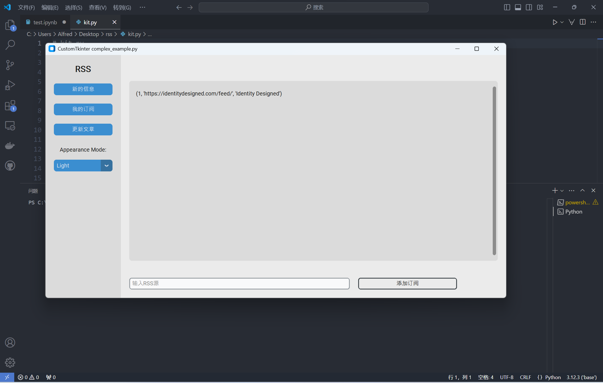

## 基于Seq2Seq的RSS订阅摘要器

> 请使用支持Markdown渲染的软件打开

> 在我的gihubio界面会继续对一些小bug进行纠正,[学习文档](https://dino1844.github.io/) 里面列举了总结的S2S知识|代码解读|学习来源|数据集

#### 基本框架

由于没有多余时间对Decoder和Encoder的几种常用神经网络方法进行效果的测试,在依据[1](https://arxiv.org/pdf/1409.3215)和[2](https://arxiv.org/pdf/1706.03762)之后综合本机性能选择**下面的模型**进行实现

#### 代码结构

#### Log

| Date             | Event                                                        |
| ---------------- | ------------------------------------------------------------ |
| **9.21**, 09:15  | 开始学习customtkinter框架,搭建好基本GUI                      |
| **9.21**, 13:55  | 开始安排db储存url数据和预存数据,防止过度更新                 |
| **9.22**, AllDay | 学习了RNN下一些神经网络框架,查资料决定使用框架               |
| **9.23**, 19:27  | 更新GUI操作逻辑,放弃一些用户友好的完善                       |
| **9.23**, 20:08  | 写爬虫函数,使用特殊技巧.写一些初始文档,最后面应该还要写一个文档放github.io上 |
| **9.23**, 21:30  | 基于HMM写了中文分词器tokenizationDemo.py,但是没有数据集效果不好,改用[jieba](https://github.com/fxsjy/jieba)分词 |
| **9.24**, 15:34  | 学习一些pytorch的基本操作和模型搭建的技巧                    |
| **9.26**  12:53  | 研读代码,复现Dataloader和predict,torchtext没有cpu版本,微调torchtext源码,矩阵乘法错误,估计也是cuda转换的问题,明天解决:-( |
| **9.28** 15:19   | 本机运行需要22h,所以在网络平台配置环境,去阿里云跑一下跑了3个小时,cuda out of memory了,调小batch值再尝试一下 |

#### Demo的原因

> 时间水平有限,最终想要达成的效果也没有实现,缺漏列举如下

1. **只支持中文**:  一是因为分词是中文分词,模型也是通过中文训练的;二是因为爬虫的时候为中文定制了一些取巧的手段
2. **刷新比较慢**: 一是数据库提取没经过优化, 逻辑正确但不快;二是未添加交互的trick，比如添加一个加载圈用户体验会比较好
3. **用户交互不友好**: 这个GUI其实就是一个为了增加代码量与我经验的套壳, 不必过于纠结 :-)
4. **软件思路错误**: 我之前还以为S2S相比于transfomer以及一些pre_trained的模型会比较不吃算力  可以做成正常运行的交互软件 事实证明我是错的 这种软件还是需要搭建后端的提供算力的api的
4. **时间有限算力有限,最后的model没有输出**,所以后续的测试我会放在我的github博客上

